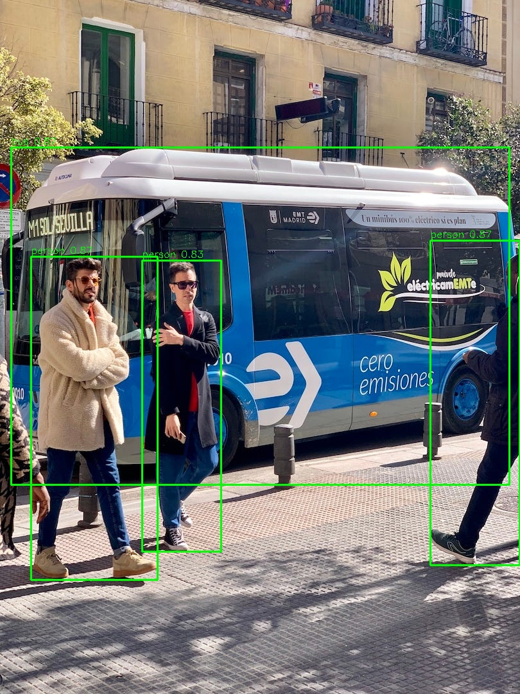
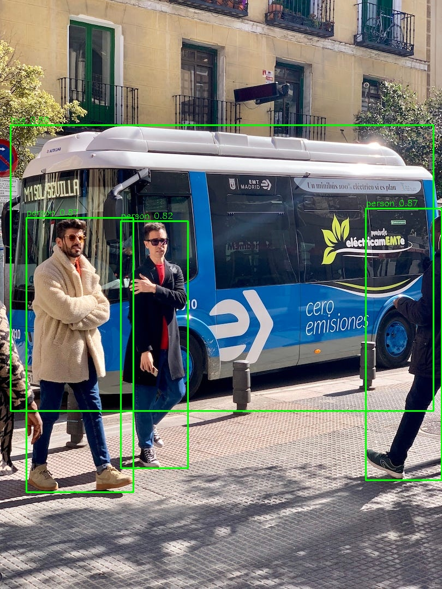

# YOLOv8 TensorRT Inference Pipeline with NVIDIA DALI

## feature
1. 支援 OpenCV 及 DALI 前處理，可自由切換
2. 支援 batch inference
3. 高吞吐、低延遲：完全榨乾 GPU 性能
4. 同時支援 end2end 以及原始輸出格式的 TensorRT engine
5. 支援 YOLOv8 / YOLOv10 模型 (TensorRT v8, v10)

## Requirements
```bash
pip3 install nvidia-dali-cuda120
pip3 install cupy-cuda120
pip3 install cuda-python
pip3 install opencv-python
pip3 install ultralytics
```
## Benchmark RTX4070 Super / Cuda 12.2 / YOLOv8n
|      Backend      | Batch Size | 	Latency / Frame | FPS  |
|:---------------:|:--------------:|:---------- |:---- |
|DALI (fp16-end2end)| 1 | 3.8ms | 268.42|
| Opencv(fp16-end2end)|1| 4.9ms |  205.2 |
| DALI (fp16-end2end) |    30  | 1.2ms | 857.53|
| Opencv(fp16-end2end) |   30  | 3.3ms | 302.88 |
|DALI (fp16)|    1   |5.0ms | 201.73|
| Opencv(fp16)|    1  | 6.2ms    |  162.43 |
| DALI (fp16) |    30  | 2.4ms    | 417.1|
| Opencv(fp16) |   30  | 4.4ms    | 225.21|

##  Inference Results
- opencv前處理

- DALI 前處理


## Run Inference
-  圖片模式
- --image_dir 指定圖目錄 
- --model_path 指定模型路徑
- --input_size 模型輸入大小(default 640*640)
- --batch_size 推理批次量(defualt 1)
- --use_dali 啟動DALI前處理
- --end2end end2end 模型後處理
```bash
 python3 main.py --image_dir ./images  --model_path ./model/yolov8n_640_batch1_end2end_fp16.engine --end2end  --use_dali
```
- 使用影片進行推論
- --video 指影影片路徑
```bash
 python3 main.py --video ./testdata/test.mp4  --model_path ./model/yolov8n_640_batch1_end2end_fp16.engine --end2end  --use_dali
```

##  Export .pt to TensorRT Engine：
使用 export.py 一鍵轉換 YOLOv8 / v10 的模型至 ONNX / TensorRT engine。

- --weights .pt檔路徑
- --imgsz 模型輸入大小(default 640*640)
- --batch 模型批次量(因為為靜態engine defualt 1)
- --format 使用onnx or trt做onnx engine 單獨轉換, 或是使用both 一鍵.pt --> engine轉換 
- --output_dir 模型儲存路徑
- --end2end 轉換end2end模型 （非必要）
- --v8 / --v10：指定 YOLOv8 或 YOLOv10

```bash
 python3 export.py --weights ./model/yolov8n.pt --format both --end2end --v8
```


